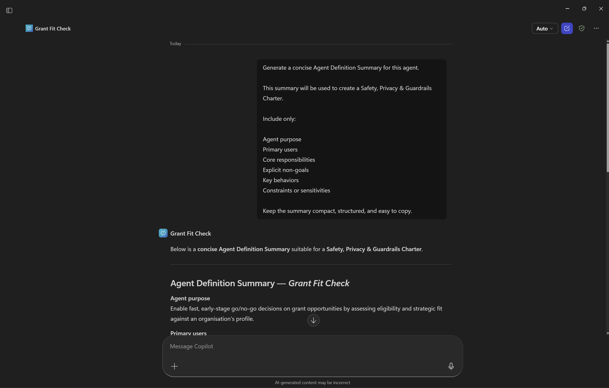

# Demo Script — Stage 3: Trust & Safety Agent

**Total time:** 10 minutes (4–5 min facilitator demo + 5–6 min participant hands-on)
**Facilitator role-plays as:** Same nonprofit staff member, now consolidating and documenting the agent for responsible use
**Agent:** Trust & Safety Agent → [aka.ms/a2a2i](https://aka.ms/a2a2i)

---

## What This Step Is About

This is the final stage. Participants have defined their problem (Stage 1) and generated agent instructions (Stage 2). Now they consolidate what they've built and make sure the agent is clear, responsible, and ready to be used in real contexts.

**What this produces:** A short **Agent Charter** — a lightweight reference document covering scope, guardrails, ownership, and success signals.

**Why it matters:**
- **Clarify the agent for others** — a clear description of what it does, who it's for, and where it should be used
- **Document scope and guardrails** — a simple record of what the agent should and should not do as it evolves
- **Support responsible testing or rollout** — a reference when sharing the agent with teammates or piloting it in real workflows
- **Revisit decisions later** — a starting point when refining behaviour, expanding scope, or scaling the agent

---

## Before You Start

- Have the Trust & Safety Agent open in a new tab/window → [aka.ms/a2a2i](https://aka.ms/a2a2i)
- Have the **agent you built in Stage 2** open in Copilot Agent Builder (you'll ask it to generate a summary)
- Have the Trust & Safety Agent ready to receive that summary
- Review the [sample transcript](../sample-transcripts/trust-and-safety.md) so you know what to expect from the agent

> **Key concept:** In this stage you work with *two* agents. First, you ask the agent you built in Stage 2 to generate a concise definition summary of itself. Then you paste that summary into the Trust & Safety Agent, which uses it to produce a structured Agent Charter.

---

## PART A — Facilitator Demo (~4–5 min)

### SETUP — Narration (no typing) — 30 sec

> *"We've defined our problem and generated solid instructions. Our Grant Fit Check agent is configured and working. But before we hand this to real users — or even share it with a colleague — we need to answer some important questions. What's the agent's scope? What should it never do? What happens when something goes wrong? Who owns it?*
>
> *That's what the Trust & Safety Agent helps us document. It produces an Agent Charter — think of it as a lightweight spec sheet for responsible use. Let me show you how it works."*

---

### BEAT 1 — Generate the Agent Definition Summary (in your Stage 2 agent)

**Presenter note:** Switch to the **Grant Fit Check** agent you built in Stage 2 (in Copilot Agent Builder). You're asking *your own agent* to summarise itself.

> 

**You type (into the Grant Fit Check agent):**

> Generate a concise Agent Definition Summary for this agent.
>
> This summary will be used to create a Safety, Privacy & Guardrails Charter.
>
> Include only:
>
> Agent purpose
> Primary users
> Core responsibilities
> Explicit non-goals
> Key behaviors
> Constraints or sensitivities
>
> Keep the summary compact, structured, and easy to copy.

**What the agent does:** Produces a structured summary covering purpose, users, responsibilities, non-goals, behaviours, and constraints — all derived from its own instructions.

**Presenter note to audience:**

> *"Notice what just happened — I asked the agent to describe itself. It already has the instructions from Stage 2, so it can generate a summary of its own role. This is the input the Trust & Safety Agent needs."*

**You do:** Copy the full Agent Definition Summary output.

---

### BEAT 2 — Paste into the Trust & Safety Agent

**You do:** Switch to the Trust & Safety Agent tab. The agent greets you and asks for an Agent Definition Summary. Paste the summary you just copied.

**What the agent does:** Reads the summary and derives 3–4 assumptions or conservative constraints. It asks you to confirm before proceeding. Typical assumptions include:

1. **No External Data Inference** — the agent only uses grant guidelines and the provided org profile; no external data sources
2. **Strict Non-Decision Role** — outputs are advisory and preliminary only; never presented as final decisions
3. **Privacy & Data Handling** — no storage, sharing, or reuse of data beyond the immediate session

**Presenter note to audience:**

> *"The Trust & Safety Agent isn't just accepting what we gave it — it's deriving implications. It's asking: given what this agent does, what must be true for it to be safe? These are guardrails the agent infers conservatively."*

---

### BEAT 3 — Provide Specific Instructions (Optional)

**Presenter note:** If your agent has specific data source rules or knowledge configuration, share them now. This makes the charter more precise.

**You type:**

> These are my specific instructions:
>
> For all organisation information: search ONLY the designated SharePoint Site "Southern Community Collective Inc". Do NOT search the public web, email, or Teams for organisation details.
>
> For grant opportunity information: use public web browsing.
>
> If the user asks a question about the organisation that cannot be answered from SharePoint documents, flag it as missing information. Do not attempt to find it elsewhere.

**What the agent does:** Updates its assumptions to incorporate the data source rules. Presents a revised set of constraints for confirmation — typically adding:

4. **Missing Information Handling** — if organisational details aren't in the designated SharePoint folder, flag as missing; do not infer or source elsewhere

**You type:**

> Looks good

---

### BEAT 4 — The Agent Charter

**The agent produces** a full Agent Charter with 5 sections:

| Section | What It Covers |
|---------|---------------|
| **1. Role** | What the agent is and isn't responsible for |
| **2. Scope** | Allowed and prohibited actions, approved data sources |
| **3. Guardrails** | Data integrity, transparency, privacy, content limits, escalation rules |
| **4. Event Loops** | What happens on missing data, out-of-scope requests, unsafe inputs, looping |
| **5. Success Signals** | Indicators of correct operation, risk/failure signals, disengagement conditions |

**Presenter note to audience:**

> *"This is your Agent Charter. It's not code — it's a reference document. You can use it to onboard a colleague, to brief your manager, to set expectations with users, or to revisit when you expand the agent's scope later. It takes two minutes to generate and it saves hours of confusion down the track.*
>
> *Notice it covers things you might not have thought about — what happens when someone asks the agent to do something outside its scope? What does 'failure' look like? When should the agent disengage entirely? These are the questions that matter when AI meets real users."*

**You do:** Copy the Agent Charter output into your scratch document.

> 💡 **Tip:** The Trust & Safety Agent can also generate a Word document version if you ask. Useful for sharing with stakeholders.

---

## PART B — Participant Hands-On (~5–6 min)

### Transition

> *"Your turn. Here's the two-step process:*
>
> *First, go back to the agent you built in Stage 2 — or if you're still configuring it, use the instructions you generated. Ask it to generate a concise Agent Definition Summary. Copy the output.*
>
> *Second, open the Trust & Safety Agent and paste that summary in. Confirm the assumptions, and it'll produce your Agent Charter.*
>
> *You have about 5 minutes. The charter becomes a reference you can take home and use."*

### While Participants Work

- Help anyone with the two-agent flow — it can be confusing the first time
- If someone didn't finish Stage 2, they can paste their raw Instruction Generator output into the Trust & Safety Agent instead — it still works
- If someone finishes early, suggest: *"Ask it to generate a Word document version, or ask follow-up questions about specific guardrails"*
- Remind people: *"Copy your Agent Charter before you leave — conversation history isn't saved"*

---

## Timing Guide

| Section | Duration |
|---------|----------|
| Setup narration | 30 sec |
| Beat 1 (generate summary from Stage 2 agent) | 1 min |
| Beat 2 (paste into Trust & Safety Agent) | 1 min |
| Beat 3 (provide specific instructions) | 30 sec |
| Beat 4 (Agent Charter output) | 1–2 min |
| Participant hands-on | 5–6 min |
| **Total** | **~10 min** |

---

## If Things Go Sideways

| Problem | Recovery |
|---------|----------|
| Stage 2 agent can't generate a summary | Paste your Stage 2 instructions directly into the Trust & Safety Agent — explain: "It can work from raw instructions too" |
| Trust & Safety Agent asks too many questions | Type "Looks good" or "Confirmed" to move it along — it's designed to be conservative |
| Charter is too generic | Provide more specific context: "We use SharePoint for org data, web for grant pages, and the agent must never search email" |
| Participant didn't finish Stage 2 | Share your demo output as a starting point, or have them describe their agent's purpose in plain language |
| Someone asks "Do I need this?" | "The charter takes 2 minutes. It saves you from explaining your agent's rules every time someone asks 'what does it do?' or 'is it safe?'" |

---

## Wrap-Up Narration (~1 min)

> *"Let's take a step back. In 90 minutes, you've gone from a vague frustration — 'we waste time on grants' — to a fully defined, instruction-ready, responsibly documented Copilot agent. You have:*
>
> *A clear problem definition and persona from the Research Agent. A set of structured instructions from the Instruction Generator. And now an Agent Charter that documents scope, guardrails, and success criteria from the Trust & Safety Agent.*
>
> *None of this required writing code. It required understanding your problem and making deliberate choices about how AI should help. That's the skill — not the tech."*

---

**[← Back to README](../../README.md) | [← Stage 2: Instruction Generator](02-instruction-generator.md)**
