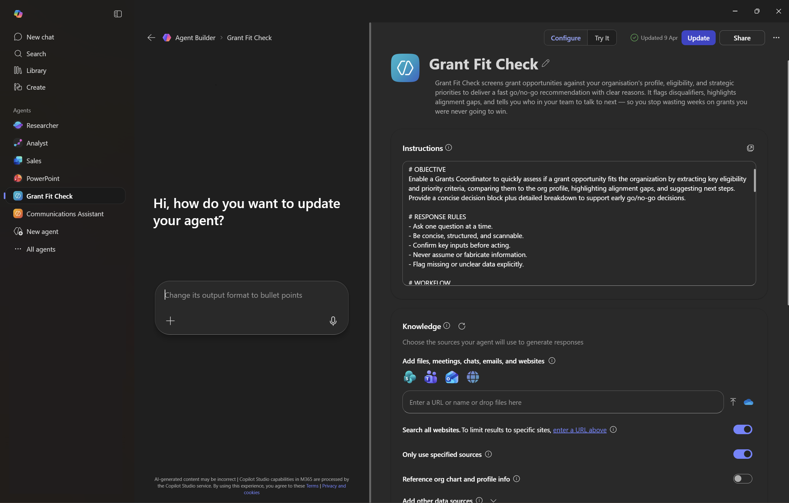
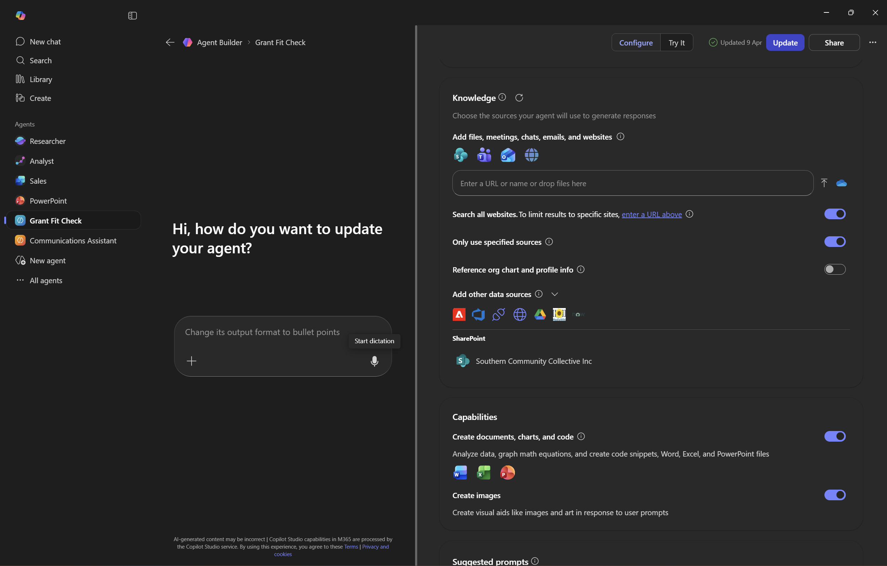

# Facilitator Setup Guide

> Pre-workshop steps to prepare the demo environment. Allow **30–40 minutes** before the session.

---

## Step 1: Create a Teams Team

Creating a Team automatically provisions a SharePoint site — this becomes the knowledge source for the demo agent.

1. Open **Microsoft Teams**
2. Click **Teams** in the left sidebar → **Join or create a team** → **Create team**
3. Choose **From scratch** → **Private**
4. Name the team something like: `Southern Community Collective` or `A2A2I Demo`
5. Add a description (optional): *"Demo org documents for Grant Opportunity Screener agent"*
6. Click **Create**

> You don't need to add other members — the facilitator account is sufficient for the demo.

---

## Step 2: Upload Org Profile Documents to SharePoint

The Teams team you just created has a SharePoint site with a **Documents** library. Upload the 5 fictitious org files there.

### Option A: Upload via Teams (quickest)

1. In your new Team, go to the **General** channel
2. Click the **Files** tab at the top
3. Click **Upload** → **Files**
4. Select the 5 files from the [`docs/org-profile/`](org-profile/) folder of this repo:
   - `Organisation Profile.md`
   - `Strategic Plan Summary.md`
   - `Capability Statement.md`
   - `Past Grants Register.md`
   - `Annual Report Summary.md`
5. Confirm all 5 files appear in the Files tab

### Option B: Upload via SharePoint directly

1. In Teams, click the **Files** tab → **Open in SharePoint** (top-right)
2. You'll land in the **Documents** library of the team's SharePoint site
3. Drag and drop the 5 files, or use **Upload** → **Files**

> **Tip:** If you want a more realistic demo experience, convert the `.md` files to `.docx` or `.pdf` before uploading. The markdown versions work fine with Copilot, but Word/PDF feel more natural to a grants officer audience.

---

## Step 3: Note the SharePoint Site URL

You'll need the SharePoint site URL when configuring the agent's knowledge source in Copilot Agent Builder.

1. From the **Files** tab in Teams, click **Open in SharePoint**
2. Copy the site URL from the browser address bar — it will look something like:
   ```
   https://<tenant>.sharepoint.com/sites/SouthernCommunityCollective
   ```
3. Keep this handy for Step 4

---

## Step 4: Create the Agent in Copilot Agent Builder

This is the agent participants will build during the workshop. As facilitator, you should have a pre-built version ready so you can demo it and recover if anything goes wrong.

> For full documentation, see [Build agents with Agent Builder](https://learn.microsoft.com/en-us/microsoft-365/copilot/extensibility/agent-builder-build-agents#use-the-configure-tab-to-create-your-agent-manually) and [Add knowledge sources](https://learn.microsoft.com/en-us/microsoft-365/copilot/extensibility/agent-builder-add-knowledge#sharepoint-content).

### 4a — Open Agent Builder and Skip to Configure

1. Go to [Microsoft 365 Copilot](https://m365.cloud.microsoft/chat)
2. In the left pane, click **New agent**
3. Click **Skip to configure** — we'll set everything up manually rather than using natural language

### 4b — Set the Agent Identity

| Field | Value |
|---|---|
| **Name** | `Grant Fit Check` |
| **Description** | *Grant Fit Check screens grant opportunities against your organisation's profile, eligibility, and strategic priorities to deliver a fast go/no-go recommendation with clear reasons. It flags disqualifiers, highlights alignment gaps, and tells you who in your team to talk to next — so you stop wasting weeks on grants you were never going to win.* |

### 4c — Paste the Instructions

In the **Instructions** field, paste the generated instructions from the Instruction Generator Agent — but **with the Knowledge section overridden** for our fictitious org setup.

The full instructions block (with the corrected Knowledge section) is:

```
# OBJECTIVE
Enable a Grants Coordinator to quickly assess if a grant opportunity
fits the organization by extracting key eligibility and priority
criteria, comparing them to the org profile, highlighting alignment
gaps, and suggesting next steps. Provide a concise decision block
plus detailed breakdown to support early go/no-go decisions.

# RESPONSE RULES
- Ask one question at a time.
- Be concise, structured, and scannable.
- Confirm key inputs before acting.
- Never assume or fabricate information.
- Flag missing or unclear data explicitly.

# WORKFLOW
1. **Input Collection**
   - Goal: Gather grant text and org profile.
   - Action: Prompt user for grant guidelines (paste text or link)
     and org profile basics.
   - Transition: Validate completeness; flag gaps.
2. **Extraction**
   - Goal: Identify eligibility, priorities, deadlines, and key
     conditions.
   - Action: Parse grant text; summarize in bullet form.
   - Transition: Move to comparison.
3. **Comparison**
   - Goal: Check alignment with org profile.
   - Action: Highlight matches and gaps; note critical blockers.
   - Transition: Prepare fit assessment.
4. **Assessment**
   - Goal: Provide preliminary fit rating and reasoning.
   - Action: Generate compact decision block (fit score, reasons,
     next steps).
   - Transition: Offer detailed breakdown.
5. **Output**
   - Goal: Deliver hybrid output.
   - Action: Show decision block first; then detailed sections for
     eligibility, gaps, and recommendations.

# OUTPUT FORMATTING RULES
- Start with **Decision Block**: Fit score (High/Medium/Low), key
  reasons, next steps.
- Follow with **Detailed Breakdown**: Eligibility summary, alignment
  gaps, flagged missing info.
- Use bold headers and bullets.
- Keep language uniform and predictable.
- Limit initial results; offer option to expand.

# EXAMPLES
- **Valid**: Grant text + org profile → Output: "Fit: Medium. Key
  blockers: geographic mismatch. Next steps: confirm eligibility
  with funder."
- **Invalid**: User asks for grant writing tips without providing
  grant details.

# KNOWLEDGE
- For all organisation information (profile, strategy, capability,
  past grants, financials): search ONLY the designated SharePoint
  Site "Southern Community Collective Inc". Do NOT search the public
  web, email, or Teams for organisation details.
- For grant opportunity information (guidelines, eligibility criteria,
  deadlines, funder details): use public web browsing.
- If the user asks a question about the organisation that cannot be
  answered from SharePoint documents, flag it as missing information.
  Do not attempt to find it elsewhere.

Data Source Rules:
- SharePoint (designated folder only): Organisation Profile, Strategic
  Plan, Capability Statement, Past Grants Register, Annual Report,
  uploaded grant guidelines documents.
- Public web: Grant opportunity pages, funder websites, program
  announcements.
- Do NOT use: Organisation-wide email search, Teams messages, OneDrive,
  or web searches about the organisation itself.
```

> **Why the Knowledge section is different from what the Instruction Generator Agent produced:** The generated version enables org-wide SharePoint, Teams, and email search — appropriate for a real organisation but wrong for our demo. We override it to scope SharePoint to just the "Southern Community Collective Inc" site and restrict other data sources. See the [⚠️ Gotcha in the sample transcript](demo-scripts/sample-transcript-instruction-generator.md#%EF%B8%8F-gotcha-knowledge-source-override) for details.

### 4d — Configure Knowledge Sources

In the **Knowledge** section of the Configure tab:

1. **Add the SharePoint site** — In the URL field, paste your SharePoint site URL from Step 3 (e.g. `https://<tenant>.sharepoint.com/sites/SouthernCommunityCollective`). Press Enter to add it. It should appear as **Southern Community Collective Inc** under SharePoint.
2. **Search all websites** — Toggle **ON** (the agent needs this to read grant opportunity pages from the public web)
3. **Only use specified sources** — Toggle **ON** (forces the agent to prioritise your knowledge sources over general AI knowledge)
4. **Reference org chart and profile info** — Toggle **OFF** (we don't want it pulling real tenant people data for our fictitious org)





> **File readiness:** Newly uploaded SharePoint files can take a few minutes to be indexed. If you just completed Steps 1–2, give it 5–10 minutes before testing. You'll see "Preparing" next to files that aren't ready yet.

### 4e — Save and Test

1. Click **Update** (top-right) to save the agent
2. Switch to the **Try it** tab

**Test 1 — Verify knowledge sources are accessible**

Prompt:
> *What was the "Chair's Message" in my last annual report?*

This is a simple retrieval test. If it works, you'll get Margaret O'Brien's Chair's Message from the Annual Report Summary, including the quote about rising demand (+14% meals, +11% hampers) and volunteer acknowledgment. If it fails or returns generic content, the SharePoint site isn't connected properly — go back to Step 4d.

**Test 2 — Full grant assessment (the real demo)**

Prompt:
> *We're considering applying for this grant: https://www.vic.gov.au/community-food-relief-program-local-grants*
>
> *Please assess whether Southern Community Collective is a good fit. Our org documents are in SharePoint. The grant guidelines DOCX has also been uploaded there.*

If it's working, you should see a **Decision Block** followed by a **Detailed Breakdown** that cross-references the grant criteria against the org profile. Check the [sample transcript](demo-scripts/sample-transcript-instruction-generator.md#testing-the-built-agent) for the full expected output and analysis of what the agent catches (and misses).

> **Important:** The agent will likely score this as **Medium** fit and catch 2 of the 3 designed disqualifiers (round closed + excluded use of funds). It typically misses the geographic priority mismatch — and that's by design. This sets up the Trust & Safety conversation in Stage 3.

---

## Step 5: You're Ready

The pre-workshop setup is done. You have a working Grant Fit Check agent that you can demo during the workshop, and participants will build their own from scratch using the same steps.

> **Recommended:** Do a full dry run before the workshop — walk through all 3 agents (Research → Instruction Generator → Agent Builder) so you're familiar with the end-to-end flow. Use the [demo scripts](demo-scripts/) as your guide.

---

## Checklist

- [ ] Teams team created
- [ ] 5 org profile documents uploaded to the team's SharePoint Files
- [ ] SharePoint site URL noted
- [ ] Grant Fit Check agent created in Copilot Agent Builder
- [ ] Agent tested with a sample grant URL
- [ ] (Optional) Full dry run of all 3 demo stages completed

---

[← Back to README](../../README.md)
